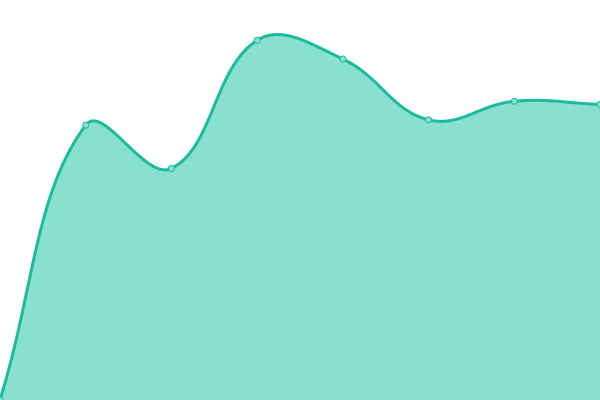
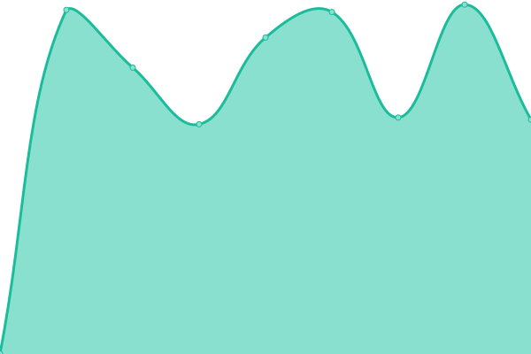

# [📈 Live Status](https://status.gneko.dev): <!--live status--> **🟧 Partial outage**

This repository contains the open-source uptime monitor and status page for [graueneko](https://github.com/gneko), powered by [Upptime](https://github.com/upptime/upptime).

With [Upptime](https://upptime.js.org), you can get your own unlimited and free uptime monitor and status page, powered entirely by a GitHub repository. We use [Issues](https://github.com/graueneko/status-page/issues) as incident reports, [Actions](https://github.com/graueneko/status-page/actions) as uptime monitors, and [Pages](https://status.gneko.dev) for the status page.

<!--start: status pages-->
<!-- This summary is generated by Upptime (https://github.com/upptime/upptime) -->
<!-- Do not edit this manually, your changes will be overwritten -->
<!-- prettier-ignore -->
| URL | Status | History | Response Time | Uptime |
| --- | ------ | ------- | ------------- | ------ |
|  [GrauNeko.com](https://graueneko.com) | 🟥 Down | [grau-neko-com.yml](https://github.com/graueneko/status-page/commits/HEAD/history/grau-neko-com.yml) | 

 2630ms
     
 | 

<a href="https://status.gneko.dev/history/grau-neko-com">98.32%</a>
    

|  [FreshRss](https://rrss.gneko.app) | 🟩 Up | [fresh-rss.yml](https://github.com/graueneko/status-page/commits/HEAD/history/fresh-rss.yml) | 

 1028ms
     
 | 

<a href="https://status.gneko.dev/history/fresh-rss">99.77%</a>
    

|  [RssHub](https://rsshub.gneko.app) | 🟩 Up | [rss-hub.yml](https://github.com/graueneko/status-page/commits/HEAD/history/rss-hub.yml) | 

 830ms
     
 | 

<a href="https://status.gneko.dev/history/rss-hub">100.00%</a>
    

|  [Bark](https://bark.gneko.app/ping) | 🟩 Up | [bark.yml](https://github.com/graueneko/status-page/commits/HEAD/history/bark.yml) | 

 832ms
     
 | 

<a href="https://status.gneko.dev/history/bark">100.00%</a>
    

|  ChatGPT | 🟩 Up | [chat-gpt.yml](https://github.com/graueneko/status-page/commits/HEAD/history/chat-gpt.yml) | 

 816ms
     
 | 

<a href="https://status.gneko.dev/history/chat-gpt">100.00%</a>
    

<!--end: status pages-->

[**Visit our status website →**](https://status.gneko.dev)

## 📄 License

- Powered by: [Upptime](https://github.com/upptime/upptime)
- Code: [MIT](./LICENSE) © [graueneko](https://github.com/gneko)
- Data in the `./history` directory: [Open Database License](https://opendatacommons.org/licenses/odbl/1-0/)
